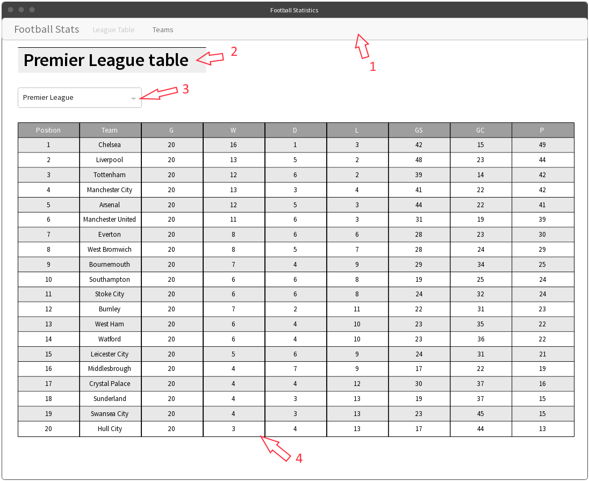
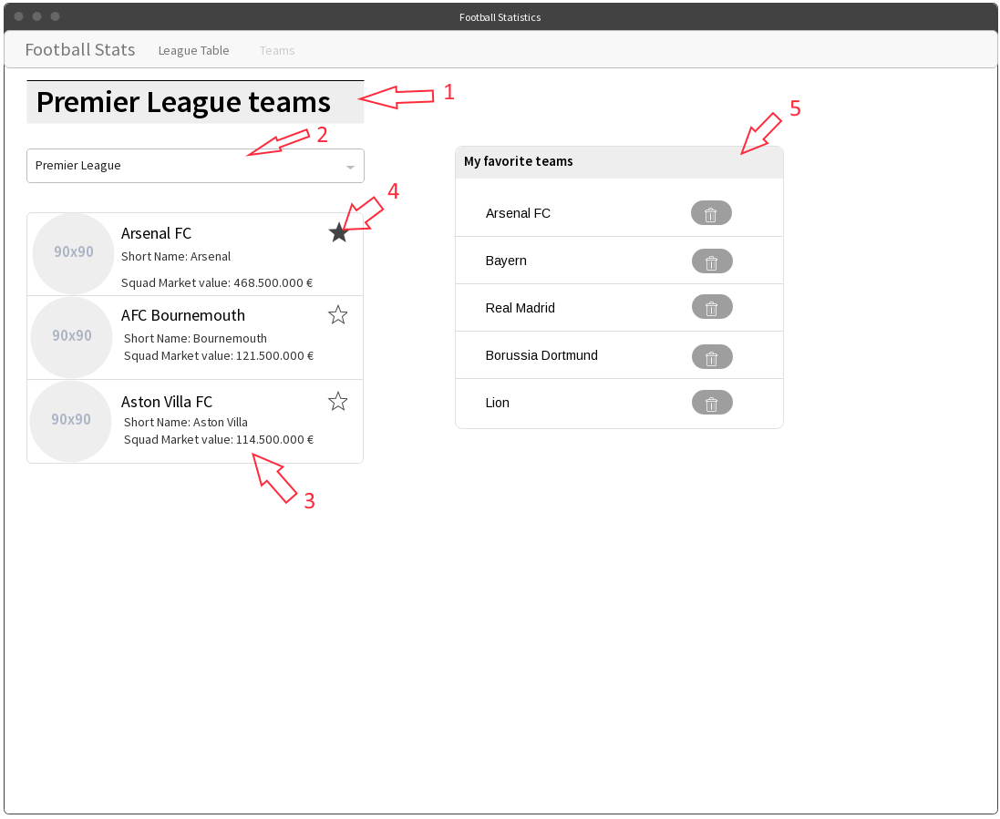
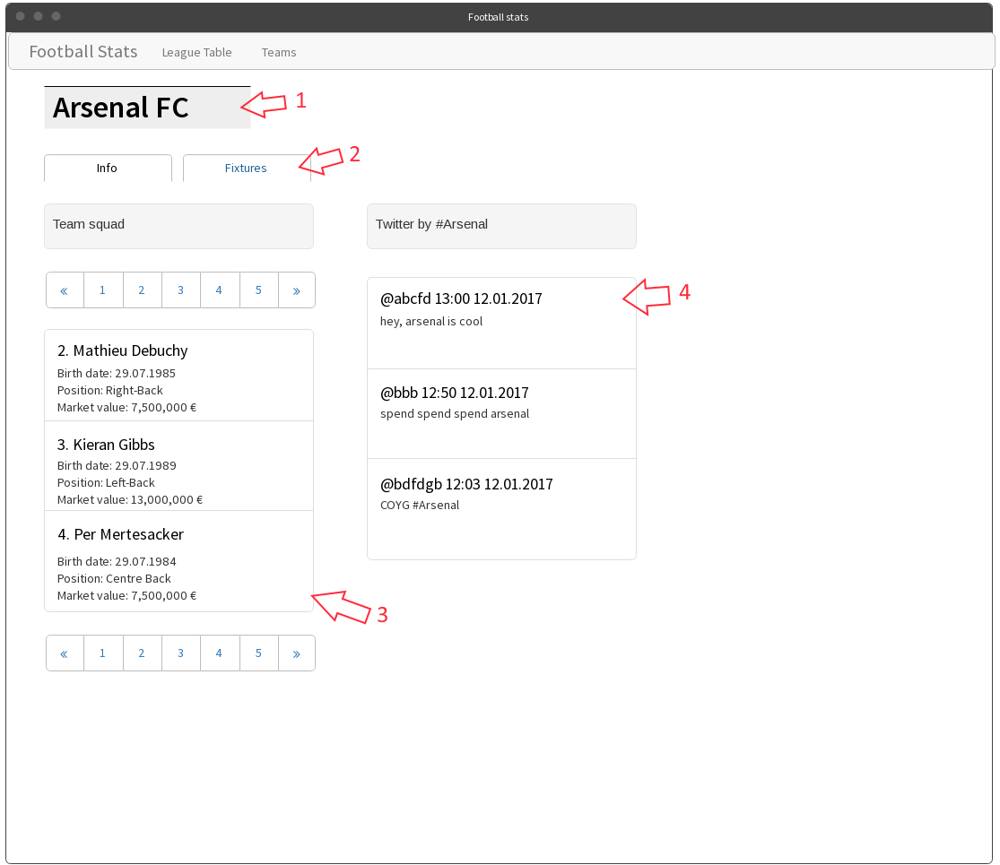
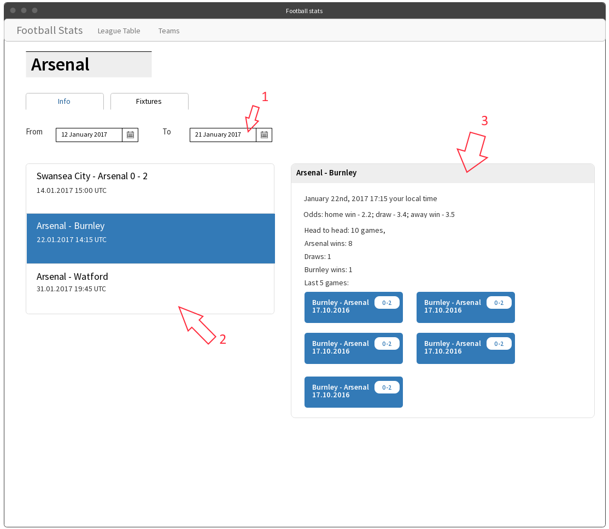

Football Statistics App “SRS”
=============================

1 Source of information
-----------------------

### 1.1 Football API

The main source of information is [Football Data
API](http://api.football-data.org/documentation). We will need the
following feeds:

1.  Competitions

2.  Teams

3.  LeagueTable

4.  Team Fixtures

5.  Fixture

6.  Single Team

7.  Players

It’s free RESTful API which provides JSON data.

### 1.2 Twitter API

[Twitter API](https://dev.twitter.com/rest/public) will be used for retrieving tweets
by club name. So the Search API will be used.To authenticate in this API you’ll need
to use your own Twitter account. If you don’t have one, you’ll need to create one.

Twitter has [embedded timelines functionality](https://dev.twitter.com/web/embedded-timelines/search).
Using this functionality is strongly prohibited. You’ll need to fetch API data
and render it in some way.

2 Pages
-------

### 2.1 League table page

League table page is the home page. Its mockup is presented on pic. 1:

Pic. 1. League table page mockup

*Figure 1* is navigation bar. It’s common for all pages in the app. It
contains following elements:

-   Site logo: Football Stats.

-   Navigation menu with two independent pages. When current page is one
    of the two, the corresponding menu item is disabled.

*Figure 2* is page header. It’s present on every page. Styling may vary,
as the picture is a mockup. It contains the name of the league +
“table”, and is dynamically updated when another league is selected.

*Figure 3* is League selector. We are interested in the following
leagues (keeping the provided order is preferred):

1.  English Premier League

2.  German 1. Bundesliga

3.  Spanish Primera

4.  Italian Serie A

5.  French League 1

When an item is selected, the table is updated to show the League table
of the selected league. By default (on page load) the first item is
selected, and therefore the league table for it is pre-loaded.

League Table is a table with the following columns:

1.  League Position

2.  Team

3.  Games

4.  Wins

5.  Draws

6.  Losses

7.  Goals scored

8.  Goals conceded

9.  Points

All columns except for Team are integer values. Team column represents
Club full name. Club name is clickable and leads to the [2.3 Team
page](#team-page).

### 2.2 Teams page

Teams page is a listing page for all the teams of a league. Its mockup
is presented on pic. 2:

Pic. 2. Teams page mockup

It has the same navigation bar. “Teams” item should be disabled as it’s
the current page.

*Figure 1* is the page header. It’s dynamically updated when another
league is selected in the League selector, Figure 2. By default (on page
load) the first league of the list is selected.

*Figure 2* is the League selector. It contains the same leagues as
defined in [2.1 League table page.](#league-table-page.)

*Figure 3* is Teams list. It contains all the teams that are returned
for the selected league without any paging. Every item represents a
single team and contains the following elements:

1.  Club logo image. Its URL is provided by the API.

2.  Club’s full name. It should be bolded and of bigger font size.

3.  Short name. It’s provided by the API and should be displayed below
    the full name.

4.  Squad market value. An integer number, value is provided in Euros.
    Delimiter should be a comma (,) and decimal mark is a dot (.).

Every items is clickable. It leads to the [2.3 Team page](#team-page).

*Figure 4* is “Add to favorite” button. If the club is not added to the
favorites, the star is empty, otherwise it’s filled with some color.

*Figure 5* is “Favorite clubs” list. It lists all clubs that has been
added to the favorites. Each Club title leads to its detailed page.
Every item has a “delete” button that removes it from the favorites
list.

### 2.3 Team page

Team page represents detailed information about the Club. Its mockup is
presented on the pic. 3:

Pic. 3. Team page mockup 1.

*Figure 1* is page header. It shows the full name of the selected club.

*Figure 2* is tab control. It consists of two tabs: “Info” and
“Fixtures”. All the content below is relevant for “Info” tab. Tab
selection *must not* trigger full page reload, and current tab button
should be disabled.

The “Info” tab consists of two layout columns: “Team squad” and “Twitter
by…”.

*Figure 3* is the list of players available for the team. Every item
represents one player. Every list item has a header, which should be
bolded and of bigger font size. Item header has the following format:
“&lt;% squad number %&gt;. &lt;% player’s name %&gt;“. All items should
be ordered by squad number. Additional information about the player
contains:

1.  Birth date in the following format: DD.MM.YYYY.

2.  Position – a string.

3.  Market value – a price in the same format as described in [2.2 Teams
    page](#teams-page).

The list should be paged in case there are more than 20 items. If there
are less than 20 items, paging controls should not be displayed.
Otherwise, paging controls should be displayed both above and below the
list.

*Figure 4* is the tweets list. It shows the most recent tweets that can
be found using Twitter’s search with club’s name. It should display no
more than 10 tweets. If there are no tweets found, there should be a
well with “No tweets found for &lt;% club name %&gt;” text.

The “Fixtures” tab mockup is presented on pic. 4:

Pic. 4. Fixtures tab mockup.

*Figure 1* is a simple form that has 2 fields that represent “from” and
“to” date limits for fixtures list. By default, “from” field is today
and “to” fields is today + 2 weeks.

*Figure 2* is fixtures list. If the match has already taken place, the
result is displayed alongside with the match title in the header. The
header has the following format: &lt;% home team short name %&gt; -
&lt;% away team short name %&gt; &lt;home team score %&gt; - &lt;% away
team score %&gt;. Additional information is the date and time (in UTC)
of the fixture. Optionally, the time may be converted to the current
user’s time zone.

The list supports selection. The selected item should have a highlighted
background. When an item is selected, fixture details appears on the
right.

*Figure 3* is fixture details. It appears only if a fixture is selected
in the fixtures list. Fixture details is a panel. Its header has the
same format as fixtures list item header. The information in the panel
includes:

1.  Date and time in the following format: MMMM Do, YYYY HH:mm zz. Time
    may optionally be converted to user’s local time zone.

2.  Odds if available. Odd is floating point number, one digit in the
    fractional part.

3.  Head to head section. Head to head describes last 10 games (max) and
    provides number of each possible result: current home team win,
    draw, current away team win.

4.  Last games section. We need to retrieve and show no more than last 5
    games. Each game is a separate badge. The badge contains home and
    away team names, the final score and the date in the following
    format: DD.MM.YYYY. The badges should be inline and wrap.

3 General requirements
----------------------

1.  Use [Knockout JS](http://knockoutjs.com/) for interacting with the
    view. It has an [excellent tutorial](http://learn.knockoutjs.com/).

2.  Use [Require.js](http://requirejs.org/) for module loading. Stick to
    CommonJS syntax.

3.  Create a single-page application. Provide routing (preferably your
    own) for it.

4.  Use ES2015+ syntax, but opt for classical syntax for classes and
    inheritance (with prototypes and Object.create) instead of ES2015
    classes – they are just syntax sugar over constructor functions.

5.  Use *XmlHttpRequest* for AJAX calls on the first phase, and *fetch
    API* on the second.

6.  Provided pages are not designs and should not be implemented in
    pixel-perfect manner. Use any CSS library to style your pages. The
    main purpose of this task is to learn JS, not CSS.

7.  Use [BEM](https://ru.bem.info/) methodology to create reusable and
    component-oriented CSS.

8.  Use **local storage** to save user’s favorite teams.

9.  Pay attention to keeping code clean and sticking to following
    principles: separation of concerns, single responsibility, KISS,
    YAGNI. The main goal of this exercise is to develop your skills in
    app architecture and code structuring.

10. Follow company [coding
    standards](https://wiki.itechart-group.com/display/codstandarts/Coding+Standard+JavaScript).

11. Do not overcomplicate your codebase so that you’ll need to build
    your front-end code on the first phase.

Mockups URL:
<https://wireframepro.mockflow.com/view/itechart-football-training>.

4 Phases
--------

### 4.1 Phase I

1.  Implement mockups [2.1 League table page](#league-table-page.) and
    [2.2 Teams page](#teams-page).

2.  Use *XmlHttpRequest* and classical inheritance pattern.

### 4.2 Phase II

1.  Implement [2.3 Team page](#team-page).

2.  Switch to *fetch API* for AJAX calls. It should as easy as possible
    to switch to another implementation.

3.  Add front-end build process to create JS and CSS bundles.

